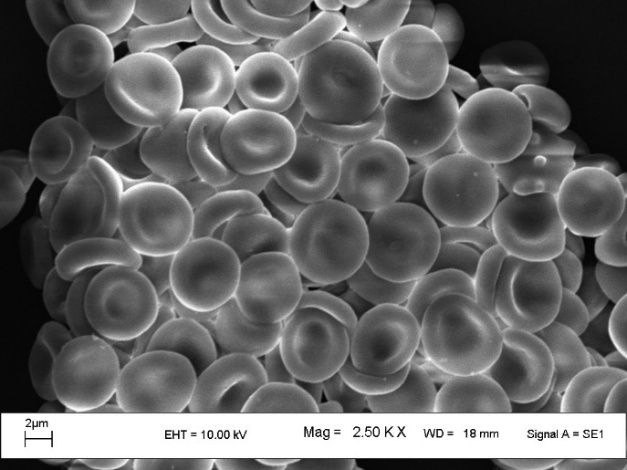
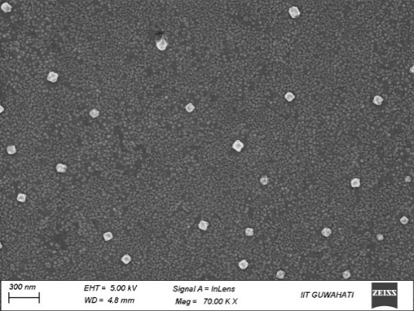

### Sample requirements for FESEM

- Sample should be dry and non-magnetic.
- Powder/metal/thin-film samples are accepted for analysis.
- Biological and liquid samples should be fixed and coated/drop-casted on a conducting substrate and dried well before the observation.
- Quantity of sample required (powder samples only): minimum 10 mg.

### 1. Preparation of nanoparticles

**Preparation of gold nanoparticles:** This method produces spherical gold nanoparticles with sizes tunable by adjusting the citrate-to-gold ratio.

**1. Materials required**

- Hydrogen tetrachloroaurate trihydrate
- Trisodium citrate dihydrate
- Deionized water
- Clean glassware (preferably treated with aqua regia to remove contaminants)

**2. Preparation of stock solutions**

- **Gold solution (1 mM):** Dissolve 0.05 g of hydrogen tetrachloroaurate trihydrate in 100 mL of deionized water.
- **Reducing agent (1% sodium citrate):** Dissolve 0.5 g of trisodium citrate dihydrate in 50 mL of deionized water.

**3. Synthesis procedure**

1. **Heat:** Bring 100 mL of the 1 mM gold solution to a vigorous boil while stirring constantly.
2. **Reduce:** Rapidly add 3-10 mL of the 1% sodium citrate solution to the boiling gold solution.
3. **Observe:** The solution will change color from light yellow to colorless, then blue/purple, and finally to a deep wine red, which indicates the formation of nanoparticles.
4. **Reflux:** Continue heating and stirring for 10-15 minutes to ensure the reaction is complete.
5. **Cool:** Remove from heat and stir until the solution cools to room temperature.

**Characterization of nanoparticle:** Use UV-Vis spectroscopy (typically showing a peak around 520 nm) to confirm formation, and DLS (dynamic light scattering) to check size. Store nanoparticles in the dark to minimize photo-induced oxidation, ideally in clean, airtight containers.

### 2. Sample preparation for SEM

**(A) Biological sample:** RBCs were washed with PBS and fixed in 1% glutaraldehyde solution for 24 h at 4 °C. Cells were washed twice with 0.1 M phosphate buffer and were dehydrated with graded ethanol from 50% to 100% in a vacuum environment. Samples were coated with gold film in a Polaron sputter coater.

**(B) Non-biological sample (nanoparticle):** Non-biological material for SEM analysis needs to be placed on a small piece of aluminium foil. The samples are mounted on a metal stub with adhesive, coated with 40-60 nm of metal, such as gold/silver/palladium, and then observed in the SEM for analysis.

**Observation:** Cells were observed with field emission scanning electron microscope Sigma Zeiss (Carl Zeiss). The instrumental settings such as EHT, width and signal were 7 kV, 3.6 mm and inLens respectively. SEM can only be used to observe samples up to 10 nm in size. The same parameters and magnification need to be used to compare different images. Figure 3 depicts SEM images of human RBCs (A) and nanoparticles (B).

<b>(A)</b>

<b>(B)</b>

<b>Figure 3: SEM images of biological and non-biological samples. (A) Human RBCs (B) Nanoparticles.</b>

