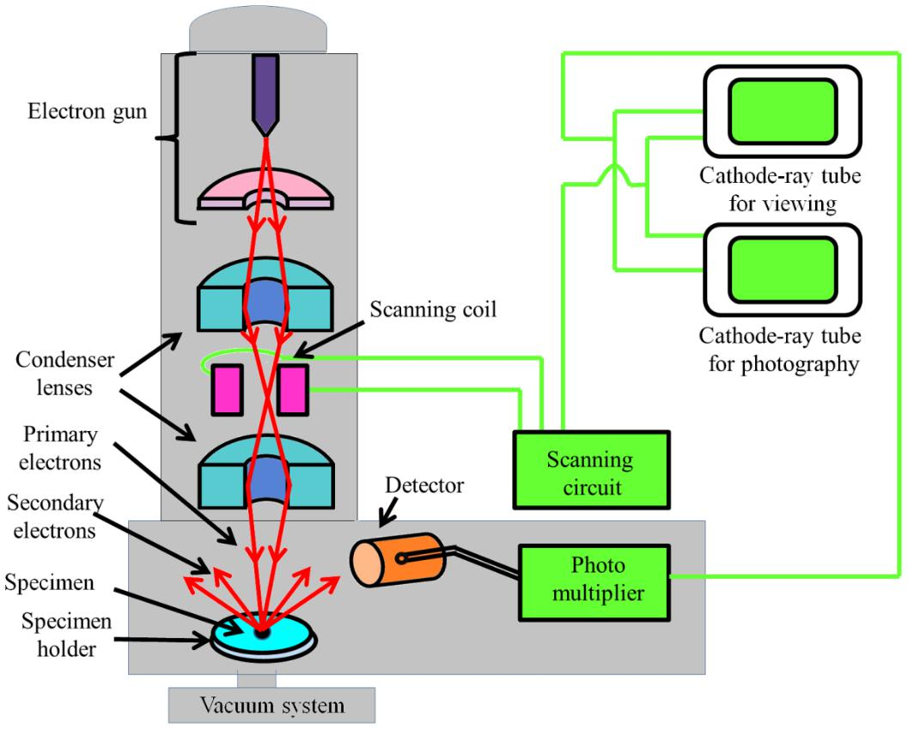

### Theory

In a SEM, the secondary electrons produced by the specimen are detected to generate an image that contains topological features of the specimen (Figure 1). The focused beam of electrons is then scanned across the surface in a raster fashion. This scanning is achieved by moving the electron beam across the specimen surface by using deflection/scanning coils. The number of secondary electrons produced by the specimen at each scanned point are plotted to give a two-dimensional image. Most electron microscopes have the detectors for the secondary electrons and the backscattered electrons. Backscattered electrons can provide useful information about the composition of the sample; materials with higher atomic number produce brighter images.

A Field Emission Source (FES), also called a cold cathode field emitter, does not heat the filament. The emission is reached by placing the filament in a huge electrical potential gradient. The FES is usually a wire of tungsten fashioned into a sharp point. Electrons are liberated from a field emission source and accelerated in a high electrical field gradient. Within the high vacuum column these so-called primary electrons are focussed and deflected by electronic lenses to produce a narrow scan beam that bombards the object. As a result, secondary electrons are emitted from each spot on the object. The angle and velocity of these secondary electrons relate to the surface structure of the object. A detector catches the secondary electrons and produces an electronic signal. This signal is amplified and transformed to a video scan-image that can be seen on a monitor or to a digital image that can be saved and processed further. The acceleration voltage between cathode and anode is commonly in the order of magnitude of 0.5 to 30 kV, and the apparatus requires an extreme vacuum (10-6 - 10-8 Pa) in the column of the microscope. Figure 1 shows a schematic of the SEM mechanism and its output.

<b>Figure 1: The basic setup of different components in scanning electron microscope.</b>

### Components of SEM

- Electron source: Field Emission Gun
- Electromagnetic and/or electrostatic lenses
- Vacuum chamber
- Sample chamber and stage
- Computer
- Detectors: Secondary Electron Detector (SE); Backscatter Detector; Diffracted Backscatter Detector (EBSD); X-ray Detector (EDS)
